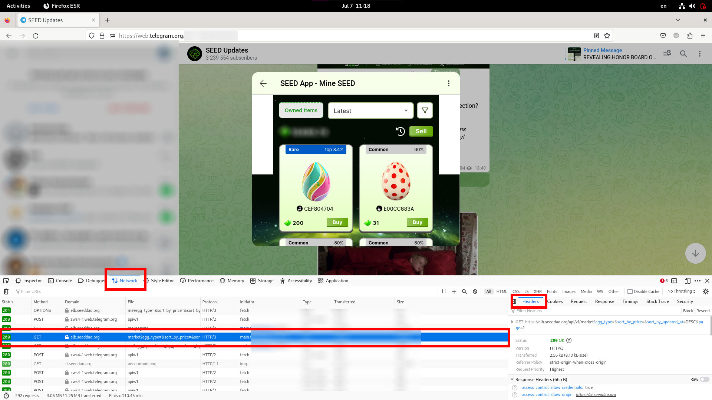
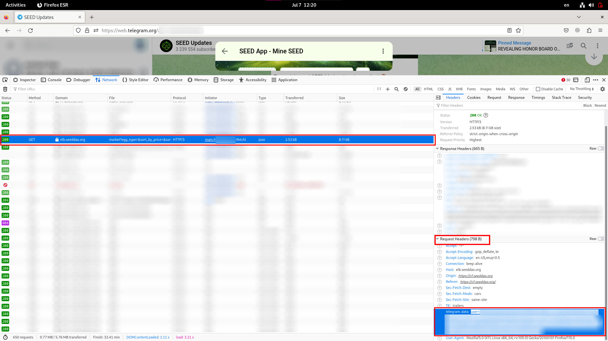
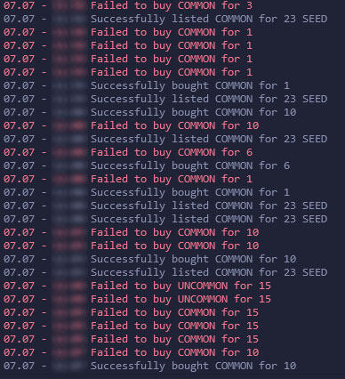

# Seed DAO Game Marketplace Bot

**Warning:** Use this bot at your own risk. There is a possibility of getting banned by the game developers, or they might change the logic of the game, which could result in losing all your coins.

## Instructions

1. **Login to Telegram Web**:
   - Open [Telegram Web](https://web.telegram.org) and log in.

2. **Open the Game and Access Developer Tools**:
   - Open the game in Telegram.
   - Open the developer console (usually `F12` or `Ctrl+Shift+I`).
   - Navigate to the **Network** tab.

3. **Capture the Market Request**:
   - Click on the marketplace icon in the game.
   - Find the `market` request in the Network tab.

   

4. **Copy `telegram_data`**:
   - In the `Request Headers`, find the `telegram_data` entry.
   - Copy the entire string starting with `"user=..."`.

   

5. **Update `settings.ts`**:
   - Open `settings.ts` in your project.
   - Paste the copied `telegram_data` string into the `TELEGRAM_DATA` variable.

## Configuration

- **BUY_PRICES**: Set the price to buy eggs if the price is less than or equal to the specified value.
- **SELL_PRICES**: Set the price to list the egg for sale immediately after purchase. If you don't want to sell, set this to `0`.

## Installation and Running the Application

1. **Install Bun**:
   - Run the following command to install Bun:

     ```sh
     curl https://bun.sh/install | bash
     ```

   - Ensure Bun is added to your PATH. You may need to source your profile:

     ```sh
     source ~/.bash_profile
     ```

2. **Run the Application**:
   - Navigate to the project directory.
   - Run the following command to start the application:

     ```sh
     bun run src/index.ts
     ```

## Output and Monitoring



- The console will display messages about the success or failure of purchases.
- A ratio of 1 successful purchase to 5 failures is normal.

## Token Expiry

- If you see the message `Failed to fetch market data: Unauthorized` in the console, refresh your Telegram Web page and copy the new token.
- The token typically lasts for about 2-3 hours.

